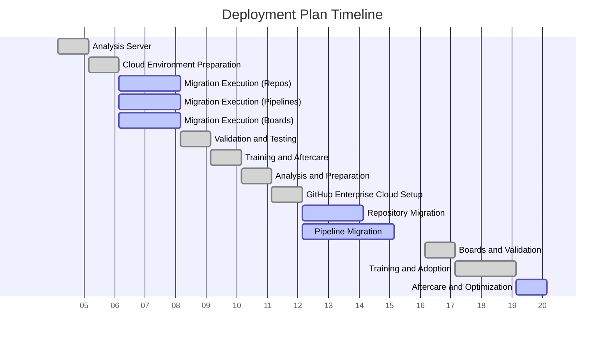

```mermaid
gantt
    title Deployment Plan Timeline
    dateFormat  YYYY-MM-DD
    axisFormat  %W
    Analysis Server:done, 2026-02-02, 7d
    Cloud Environment Preparation :done, 2026-02-09, 7d
    Migration Execution (Repos) :active, 2026-02-16, 14d
    Migration Execution (Pipelines) :active, 2026-02-16, 14d
    Migration Execution (Boards) :active, 2026-02-16, 14d
    Validation and Testing :done, 2026-03-02, 7d
    Training and Aftercare :done, 2026-03-09, 7d
    Analysis and Preparation :done, 2026-03-16, 7d
    GitHub Enterprise Cloud Setup :done, 2026-03-23, 7d
    Repository Migration :active, 2026-03-30, 14d
    Pipeline Migration :active, 2026-03-30, 21d
    Boards and Validation :done, 2026-04-27, 7d
    Training and Adoption :done, 2026-05-04, 14d
    Aftercare and Optimization :active, 2026-05-18, 7d
```
